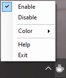

     
    
    <a href="https://github.com/TheRake66/Caffeine-for-Windows/releases/download/release/Caffeine.for.Windows.zip" target="_blank">
        <b>• Download •</b>
    </a>
     
     
    
    
    
    
     
     

# Caffeine for Windows

 Disable the screensaver and auto suspend.

 Based on GNOME extension [Caffeine by eon](https://extensions.gnome.org/extension/517/caffeine).

## Preview screenshot

 

## License and Usage Restrictions

 This project is licensed under a custom license that **prohibits commercial use**.

 For more details, see the [LICENSE](./LICENSE) file.